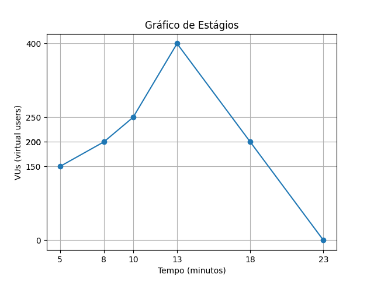

# Relatório de teste de carga 

O teste foi realizado com uma infraestrutura ECS Fargate, com uma a configuração:
- Desejáve: 1
- Autoscaling mínimo: 1
- Autoscaling máximo: 3

Os estágios definidos no Grafana K6 e a curva características são apresentadas na Figura 1.


*Figura 1 - Curva característica do teste de carga.*

O resultado do teste foi apresentado como à seguir:

```
data_received..................: 634 MB 460 kB/s
data_sent......................: 185 MB 134 kB/s
http_req_blocked...............: avg=1.59ms   min=0s      med=0s     max=16.22s p(90)=0s       p(95)=0s
http_req_connecting............: avg=1.21ms   min=0s      med=0s       max=16.22s p(90)=0s       p(95)=0s
http_req_duration..............: avg=358.74ms min=0s      med=115.97ms max=1m0s   p(90)=308.51ms p(95)=415.75ms
{ expected_response:true }...: avg=1.07s    min=119.4ms med=275.92ms max=59.5s  p(90)=1.23s    p(95)=5.04s
http_req_failed................: 78.91% ✓ 549162    ✗ 146711
http_req_receiving.............: avg=869.57µs min=0s      med=0s       max=29.66s p(90)=287.3µs  p(95)=789.1µs
http_req_sending...............: avg=9.23ms   min=0s      med=0s       max=45.42s p(90)=0s       p(95)=0s
http_req_tls_handshaking.......: avg=0s       min=0s      med=0s       max=0s     p(90)=0s       p(95)=0s
http_req_waiting...............: avg=348.63ms min=0s      med=115.89ms max=1m0s   p(90)=308.26ms p(95)=414.95ms
http_reqs......................: 695873 504.24697/s
iteration_duration.............: avg=374.66ms min=0s      med=116.13ms max=1m0s   p(90)=309.91ms p(95)=422.5ms
iterations.....................: 695873 504.24697/s
vus............................: 1      min=1       max=400
vus_max........................: 400    min=400     max=400
```

# Racionalização dos resultados

O resultado do teste de carga usando Grafana e K6 fornece várias métricas importantes relacionadas ao desempenho e ao comportamento do sistema durante o teste. O teste foi conduzido com um total de 695.873 requisições HTTP, a uma taxa média de 504,25 requisições por segundo.

Em relação ao tráfego de dados, foram recebidos 634 MB a uma taxa de 460 kB/s e enviados 185 MB a uma taxa de 134 kB/s. Isso indica a quantidade de dados transferidos entre o cliente e o servidor durante o teste.

As métricas relacionadas à duração das requisições HTTP são igualmente importantes. A duração média das requisições foi de 358,74 ms, com um mínimo de 0s e um máximo de 1 minuto. O tempo de espera (http_req_waiting) representa o tempo médio em que as requisições aguardaram por uma resposta do servidor e foi de 348,63 ms. A duração média de uma iteração (iteration_duration), que inclui o tempo de espera e o tempo de execução da requisição, foi de 374,66 ms.

No entanto, é importante notar que o teste apresentou uma taxa de falha considerável. Das 695.873 requisições, 146.711 foram concluídas com sucesso, enquanto 549.162 falharam, representando 78,91% de falha. Isso pode indicar problemas de estabilidade, capacidade insuficiente do servidor ou outros fatores que afetaram a taxa de sucesso das requisições.

O teste foi realizado variando de 1 a um máximo de 400 VUs. Isso permite avaliar o desempenho e a escalabilidade do sistema sob diferentes cargas de usuários simultâneos. O número máximo de VUs mantido constante em 400 indica a capacidade máxima do sistema em lidar com a carga do teste.

Essas métricas fornecem informações valiosas sobre o desempenho do sistema durante o teste de carga. A partir delas, é possível identificar gargalos, problemas de escalabilidade e estabilidade, bem como otimizar o desempenho geral do sistema.
